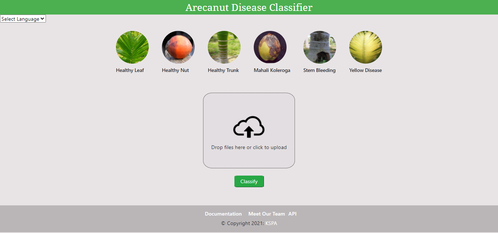

# Arecanut-Disease-Classifier

A Website that helps in detecting the
diseases of arecanut, leaves, and its trunk using Convolutional
Neural Networks and suggests remedies for it.
## Authors

- [@sainathurankar](https://github.com/sainathurankar)
- [@Basava44](https://github.com/Basava44)
## Documentation

[Documentation](https://bit.ly/2ULbNbu)

  
## Screenshots

## Run

To use this Website

[Click Here](https://bit.ly/3Ai8VTE)

  
## Demo

https://bit.ly/3hhsWBg

  
## Support

For support, email sai.ura999@gmail.com.

  
